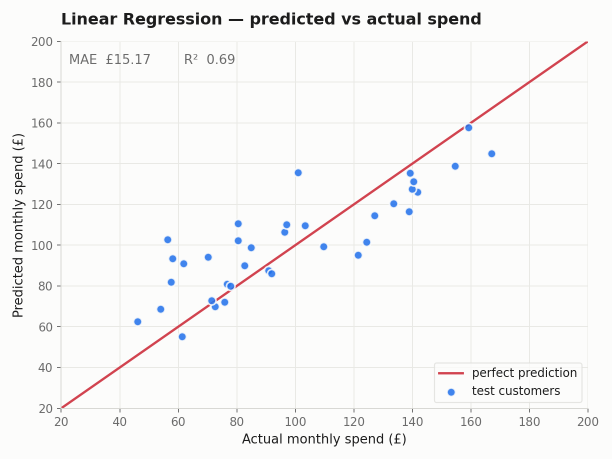
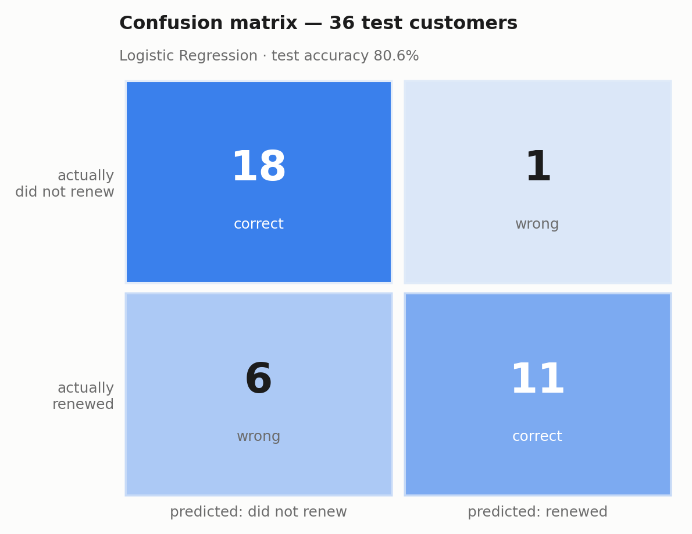
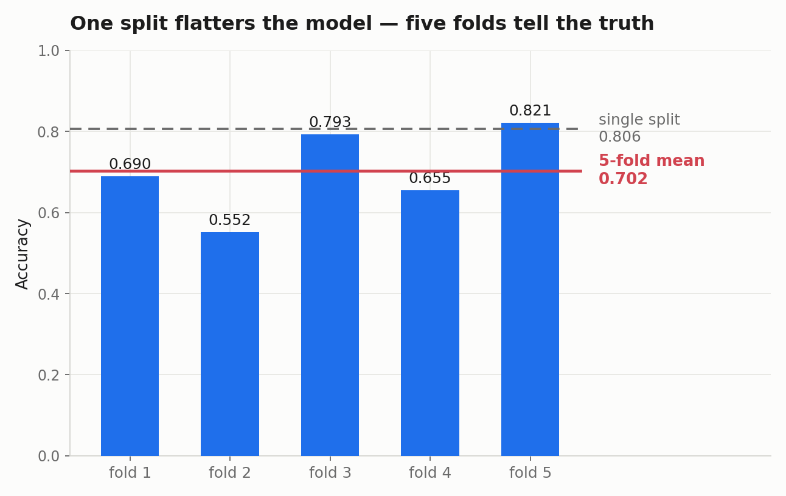

# Customer Churn and Spend Prediction

I built two models on the same five columns. One predicts how much a customer spends, the other predicts whether they stick around.

Then I tested the second one properly and watched its accuracy drop ten points.

**Python · pandas · scikit-learn · matplotlib**

---

## The setup

A subscription business knows five things about each customer:

| | |
|---|---|
| `website_visits` | how often they turn up |
| `minutes_on_site` | how long they stay |
| `emails_clicked` | whether marketing reaches them |
| `previous_spend` | what they've spent before |
| `support_tickets` | how much they complain |

Two questions come out of that, and they need different models:

| Question | Target | Model |
|---|---|---|
| How much will they spend? | `monthly_spend` | Linear Regression |
| Will they renew? | `renewed_subscription` | Logistic Regression |

One is a number, the other is a yes or no. That difference decides everything downstream.

---

## Four decisions that mattered more than the model

**I dropped `customer_id`.** It's a reference number. It describes nothing about the customer, and since every value is unique a model can quietly memorise individual IDs and look brilliant on data it has already seen.

**Neither target appears in the other's features.** `monthly_spend` is an outcome, so it never gets to predict renewal. Letting it in would hand the model half the answer.

**The classification split is stratified**, so both halves keep the real class balance instead of whatever the shuffle felt like doing.

**Cross-validation runs on the training set only.** The test set gets looked at once, at the end, and that's the number I report.

---

## Spend prediction



**MAE £15.17 · R² 0.69**

Predictions sit about £15 away from reality. Spend runs from roughly £40 to £180, so £15 is enough to tell a heavy spender from a light one and nowhere near enough to forecast a single account.

R² of 0.69 is not 69% correct. In regression nothing is correct. It means the model explains about 69% of the spread that guessing the average would leave on the table.

Here's what it worked out on its own:

```
website_visits     +1.92
minutes_on_site    +0.28
emails_clicked     +3.37
previous_spend     +0.20
support_tickets    −1.80
```

Every coefficient is positive except complaints. Nobody told it that. It found it in the data.

---

## Renewal prediction



**80.6% accuracy.** 29 of 36 held-out customers called correctly.

The seven it got wrong are not the same kind of wrong:

| What happened | How many | What it costs |
|---|---|---|
| Said they'd leave, they stayed | 6 | a retention offer you didn't need to send |
| Said they'd stay, they left | 1 | the customer |

One accuracy figure flattens that completely, which is why the matrix is here and not just the percentage.

---

## One split vs five

One split said **80.6%**. Five-fold cross-validation said **70.2%**.



The folds came out at **0.552, 0.655, 0.690, 0.793, 0.821**. That's a 27-point gap between the best and worst round, and the only thing separating them is which customers happened to land in the held-out slice.

So the 80.6% wasn't a property of the model. It was a good draw. Had I stopped at the first number I'd have reported something ten points better than what I'd actually built.

The spread tells you as much as the average does. This feature set isn't producing a stable estimate yet, and no single split would ever have shown that.

---

## The data

`customer_engagement_practice.csv`. 180 rows, 8 columns, nothing missing, 96 who left and 84 who stayed.

It's synthetic, supplied for teaching, and it's small. That's the direct cause of the fold variance above, and it's why nothing here is a claim about real customers. The method is the point.

---

## What's wrong with it

- **180 rows.** More data fixes the variance. A cleverer model doesn't.
- **Unscaled features.** Fine for these two estimators, but it makes the coefficients incomparable. `previous_spend` reaches £320 while `support_tickets` stops at 5.
- **The threshold is sitting at 0.5** because that's the default, not because anyone chose it. In retention, losing a customer usually costs more than a wasted discount, so it should be set from those numbers.
- **No tuning.** Both models run at defaults on purpose. These are the baselines you try to beat, not the finished article.

---

## Running it

```bash
pip install pandas scikit-learn matplotlib
python charts.py
```

Or open `customer_engagement_analysis.ipynb` in Colab, upload the CSV, run it top to bottom.

```
customer_engagement_analysis.ipynb   the whole workflow, with notes
customer_engagement_practice.csv     the data
charts.py                            rebuilds all three figures
fig_*.png                            the figures
```

---

## Closing note

The modelling is four imports, a split, `.fit()` and `.predict()`. You could type it in two minutes.

Everything that actually changed the outcome happened around it: deciding which columns were allowed to be clues, working out what the metric was really measuring, and not believing the first number that came back.

Built during Artificial Intelligence (M40651), BSc Computer Science, University of Portsmouth London.
